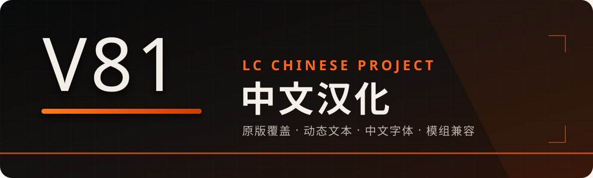
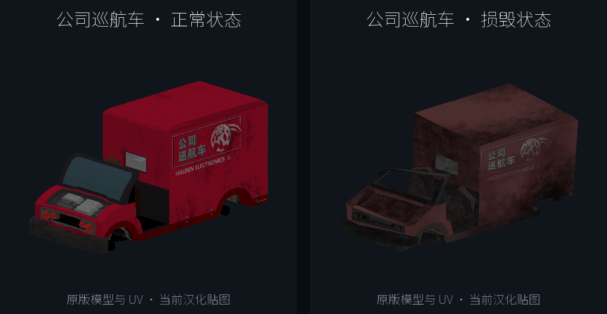
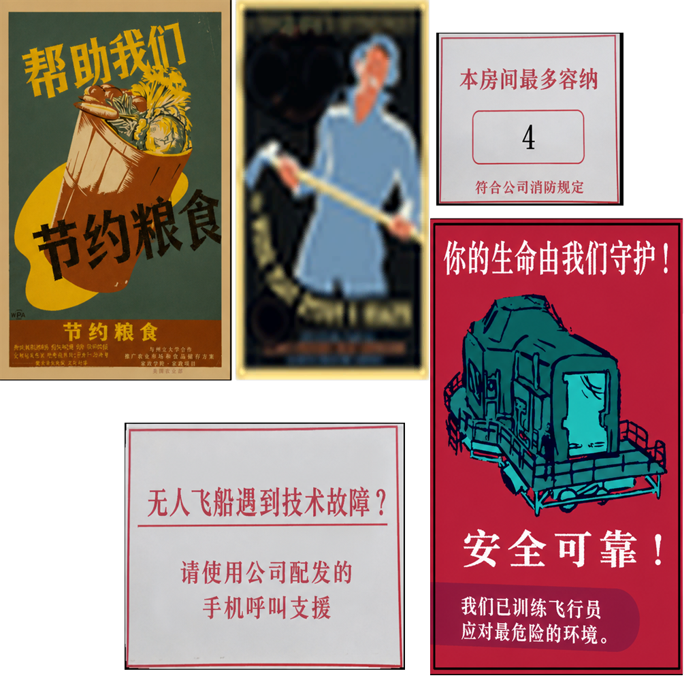
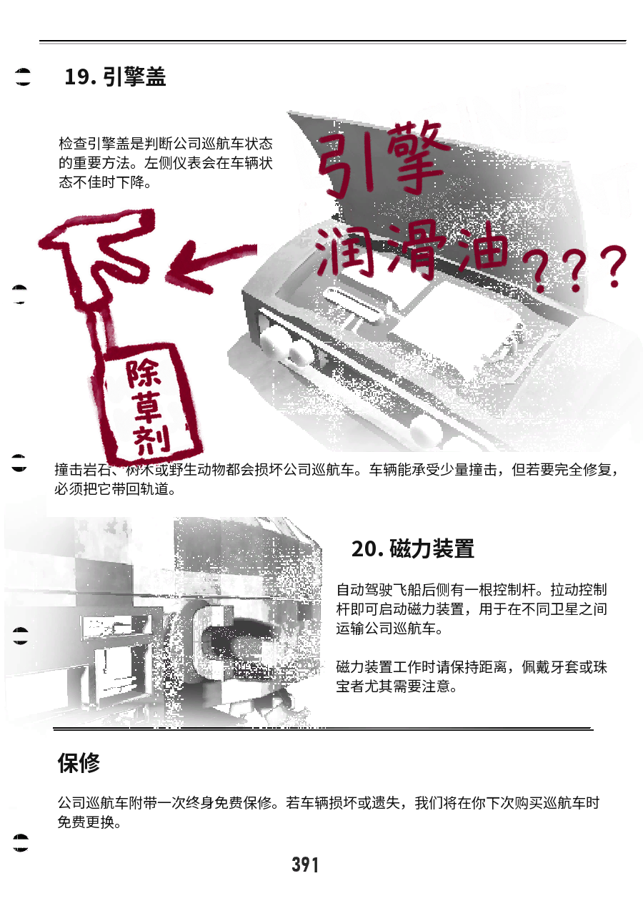
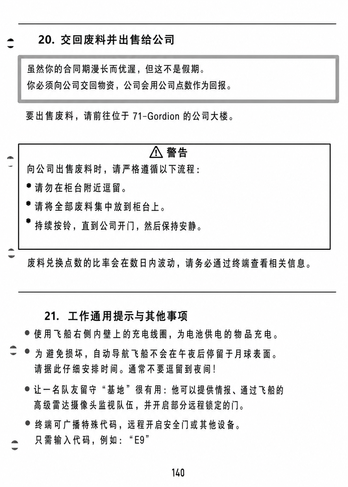
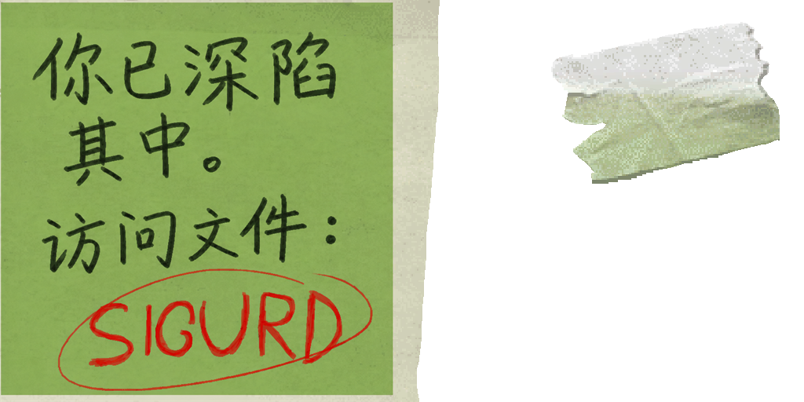
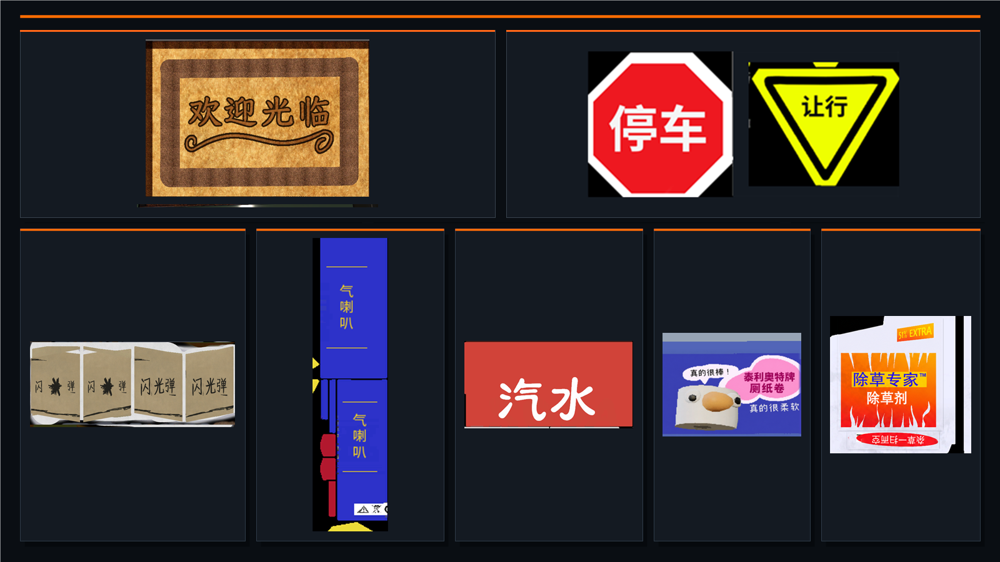
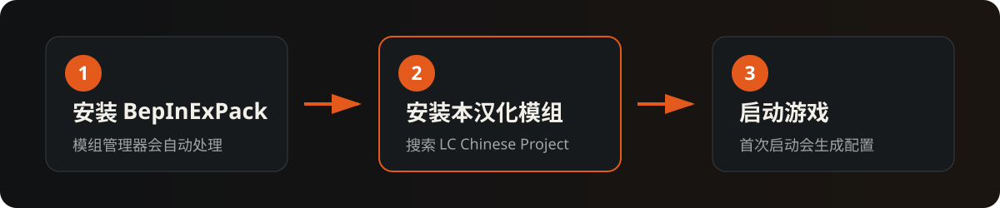

<p align="center">
  
</p>

<p align="center">
  <a href="https://github.com/Auuueser/LC-Chinese-Project/releases"></a>
  <a href="https://store.steampowered.com/app/1966720/Lethal_Company/"></a>
  <a href="https://bepinex.org/"></a>
  <a href="https://github.com/Auuueser/LC-Chinese-Project/blob/main/LICENSE"></a>
</p>

<p align="center">
  面向 <strong>Lethal Company V81</strong> 的完整简体中文体验<br>
  文本、字体、字幕与烘焙贴图统一维护，尽量保留原版气质
</p>

<p align="center">
  <a href="https://thunderstore.io/c/lethal-company/p/Aueser/LC_Chinese_Project/"></a>
  <a href="CHANGELOG.md"></a>
  <a href="https://github.com/Auuueser/LC-Chinese-Project/issues"></a>
</p>

## 汉化不止是替换文字

| 原版内容 | 视觉本地化 | 字幕与显示 | 模组兼容 |
|:--|:--|:--|:--|
| 菜单、HUD、终端、扫描、商店、星球信息、设置与结算 | 船内设施、载具、手册、告示牌与废料包装 | 中文字体、公司音频字幕与 3943 个受支持 Emoji | 保护玩家输入与内部标识，补全常见动态界面 |

默认配置即可使用。所有显示层处理均以不改变游戏状态、网络文本和模组内部数据为边界。

## 视觉预览

<p align="center">
  
  <br><sub>公司巡航车 · 干净与脏污版本</sub>
</p>

<table>
  <tr>
    <td width="50%" align="center">
      <br>
      <sub>船内海报</sub>
    </td>
    <td width="50%" align="center">
      <br>
      <sub>巡航车车载手册</sub>
    </td>
  </tr>
  <tr>
    <td width="50%" align="center">
      <br>
      <sub>手持文件夹板</sub>
    </td>
    <td width="50%" align="center">
      <br>
      <sub>船内便签</sub>
    </td>
  </tr>
</table>

### 环境、告示牌与废料包装

<p align="center">
  
  <br><sub>欢迎地垫 · 土制闪光弹 · 告示牌与多种废料包装</sub>
</p>

## 安装

<p align="center">
  
</p>

推荐使用 **r2modman / Thunderstore Mod Manager**，搜索 `LC Chinese Project` 后安装；依赖项会由管理器自动处理。

<details>
<summary>手动安装</summary>

1. 安装 `BepInExPack 5.4.2100`。
2. 将发布包中的 `BepInEx` 文件夹合并到游戏或 profile 根目录。
3. 启动游戏，确认 `BepInEx/plugins/V81TestChn/V81TestChn.dll` 已加载。

</details>

## 配置

配置文件位于：

```text
BepInEx/config/LC Chinese Project.cfg
```

支持通过 LethalConfig 调整字幕字号、位置、底板透明度及其他常用选项；通常保持默认值即可。

<details>
<summary>自定义翻译与本地构建</summary>

自定义翻译目录：

```text
BepInEx/config/V81TestChn/custom-localization/
```

本地构建：

```powershell
dotnet build src\V81TestChn\V81TestChn.csproj -c Release -p:GameDir="D:\Steam\steamapps\common\Lethal Company"
```

</details>

## 反馈与许可

遇到漏译、误译或排版问题，请在 [GitHub Issues](https://github.com/Auuueser/LC-Chinese-Project/issues) 附上截图、出现位置、模组列表及 `BepInEx/LogOutput.log`。

项目采用 [MIT License](LICENSE)。字体与第三方资源归属见 [THIRD_PARTY_LICENSES.md](THIRD_PARTY_LICENSES.md)。
